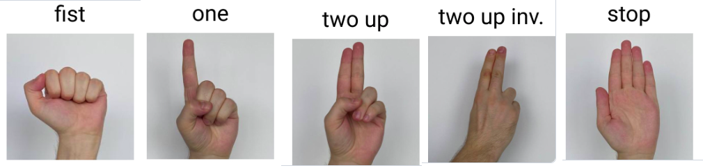

# AntiMouse
## Dự án Điều Khiển Chuột Bằng Nhận Diện Cử Chỉ Của Tay

### Giới thiệu
Dự án này nhằm tạo ra một ứng dụng cho phép người dùng điều khiển chuột máy tính bằng cách sử dụng nhận diện cử chỉ của tay, giúp tăng tính tiện lợi và tương tác cho người dùng. Ứng dụng này sử dụng các kỹ thuật nhận diện cử chỉ và máy học để chuyển động của tay thành các lệnh chuột, chẳng hạn như di chuyển chuột, nhấn chuột trái hoặc phải, cuộn chuột và nhiều tính năng khác.

### Cài đặt môi trường
```
pip install -r requirements.txt
```

### Cách chạy
```
python main.py
```
### Cách dùng


fist ---> kéo chuột

one ---> di chuyển 

two up ---> click chuột trái

two up inv ---. click chuột phải

stop ---> thoát


